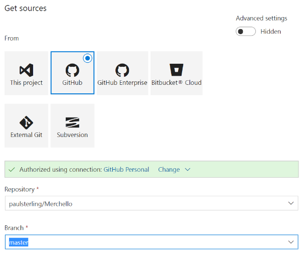

# Visual Studio Team Services Task
## Overview
This repository contains a [Visual Studio Team Services (VSTS)](https://www.visualstudio.com/en-us/products/visual-studio-team-services-vs.aspx) task for deploying a Visual Studio Web Application project with Umbraco to [Umbraco Cloud](http://umbraco.com/cloud).

The following sections describes how to use this task in your own VSTS account, how to configure the Build and Deploy and finally how to setup a Visual Studio solution with Umbraco in order to successfully deploy it to Umbraco Cloud.

The approach outlined here assumes that you have a VSTS account and an Umbraco Cloud project.

**Please note that this is an early preview**, so this Deploy task is not yet available in the VSTS Marketplace and the setup requires a few manual steps.

## Current limitations
This deployment task only offers a one way deployment of your Umbraco based web application. This means that updates that are coming from Umbraco Cloud (including updates to meta data made in Development/Staging/Live, automatic updates to Umbraco Core, Forms and Umbraco Deploy) will need to be synchronized manually. So if Umbraco is auto-upgraded from something like version 7.5.3 to 7.5.4 then you will need to update the nuget package in your web application manually - for the time being.

The idea for the future is that these updates will be part of the service for this task, so updates to Umbraco Core, Forms and Deploy are fed back to the "original" git repository as Pull Requests. Please note that there is currently no time-frame for this feature being part of Umbraco Cloud.

## How to use this Task

In order to use this task you will need to upload it to your own VSTS account since it has not yet been deployed to the VSTS Marketplace.
Use the TFS CLI which is available through NPM. Install it using the following command:
```
npm install -g tfx-cli
```
Please refer to the documentation on the TFS CLI project on github for how to login using a personal access token: [https://github.com/Microsoft/tfs-cli](https://github.com/Microsoft/tfs-cli)

Once you have logged in you can use the following command to upload the deploy task from this repository to your VSTS account:
```
tfx build tasks upload --task-path C:\path\to\tasks\DeployUaaSRepository 
```

From your Build definition click "Add build step". From the "Add tasks" dialog you should now see the "Deploy to Umbraco as a Service" task under **Deploy**.


## Setting up Build and Deploy tasks for Umbraco Cloud

The idea with using the Deploy task from this repository is that we will be able to have a Visual Studio solution with Umbaco installed (through nuget) that is built in VSTS, and then use the build output for deploying the changes to Umbraco Cloud (through git).
In order to achive this there is a minimal and recommended Build setup with the steps outlined below:


The "Build solution" step uses the following parameters:
```
/p:UseWPP_CopyWebApplication=True /p:PipelineDependsOnBuild=False /p:PublishProfile=ToFileSys.pubxml /p:DeployOnBuild=true /p:AutoParameterizationWebConfigConnectionStrings=False /p:PublishOutDir=$(Build.StagingDirectory)\_Publish
``` 
Notice that the build is published to `$(Build.StagingDirectory)\_Publish` and that it uses a publishing profile called `ToFileSys.pubxml`. This pubxml file should be placed here `/Properties/PublishProfiles/ToFileSys.pubxml` under the Web Application project where Umbraco is installed (more on that in the next section). The content of that xml file is as follows:

```
<Project ToolsVersion="4.0" xmlns="http://schemas.microsoft.com/developer/msbuild/2003">
  <PropertyGroup>
    <WebPublishMethod>FileSystem</WebPublishMethod>
    <ExcludeApp_Data>True</ExcludeApp_Data>
    <publishUrl>$(PublishOutDir)</publishUrl>
    <DeleteExistingFiles>False</DeleteExistingFiles>
  </PropertyGroup>
</Project>
```
This is what the Build solution looks like:


The "Test Assemblies" step is optional and only necessary if you have and want to run tests from the Visual Studio solution that is being built.
Finally, the Deploy task needs to be configured to the Umbraco Cloud Project.


The "Clone Url" is the git repository url for either Development or Live (depending on the type of Project you created).
Username and Password are the credentials you use to clone the repository (in the password field you can enter a variable and enter the actual password under the Variables tab in VSTS).

The "Source Path" is where the build output is published to and the "Destination Path" is where this Deploy task will clone the Umbraco Cloud git repository to. This task will then handle copying the build output to the git repository, commit the changed files and finally push it to Umbraco Cloud. 

## Setting up Umbraco in Visual Studio

Now that the Build and Deploy steps are configured we need to create a Visual Studio solution with a Web Application and install the UmbracoCms nuget, so we have something to deploy to the Umbraco Cloud Project.

In Visual Studio create a new and empty Web Application. Install the following nuget packages:
```
Install-Package UmbracoCms
Install-Package UmbracoForms
```
The version of these packages should correspond to the version of Umbraco that you get with your Umbraco Cloud Project. This is typically the latest stable version. Clone the git repository for your Umbraco Cloud Project to double check if you are unsure of the correct version to use.

Umbraco Deploy is currently not available as a nuget package, so you will need to download the release for Umbraco Cloud from [http://nightly.umbraco.org/?container=umbraco-deploy-release](http://nightly.umbraco.org/?container=umbraco-deploy-release) - download the zip with the latest version called Courier.Concorde.UI.vX.XX.X.zip (this is the version of Courier that targets Umbaco as a Service and is typically referred to as Umbraco Deploy).
Unzip and copy the files to the root of the Web Application where Umbraco was installed (it's usually a good idea to copy the assemblies to a lib folder for reference in the Web Application project).

Next step involves copying a few dependencies and settings from the Umbraco Cloud git repository, so clone the repository to your local machine if you haven't already done so.
From the cloned repository you want to copy the following files to the Web Application project (with Umbraco installed):
* /Config/UmbracoDeploy.config (contains settings for the environments/workspaces in your Project)
* /App_Plugins/UmbracoLicenses/umbracoForms.lic (to ensure that both Forms and Courier work)
* /data/backoffice/* (your backoffice user, which must match the one on Umbraco Cloud)
* /data/Revision/*   (meta data from your Umbraco Cloud site - FYI the data folder doesn't need to be included in a Project in VS, as long as they are committed to your git repository they will be deployed to Umbraco Cloud as part of the build + deploy tasks)

Add or update the following AppSettings in web.config (the version should of course correspond to the one installed):
```
<add key="umbracoConfigurationStatus" value="7.4.3" />
<add key="UmbracoLicensesDirectory" value="~/App_Plugins/UmbracoLicenses/" />
```

Set the connection string for `umbracoDbDSN` to:
```
<add name="umbracoDbDSN" connectionString="Data Source=|DataDirectory|\Umbraco.sdf" providerName="System.Data.SqlServerCe.4.0" />
```

Setting the version and connection string in web.config means that the site is configured, and you can just start it from VS, IIS or IISExpress and it will create a Sql Ce database and install the Umbraco database schema on startup. And with that you should be up and running locally.
So only thing left is then to add the publish xml file (mentioned in the previous section) to `/Properties/PublishProfiles/ToFileSys.pubxml` under the Web Application project where Umbraco is installed. 

Now that the Visual Studio solution is setup with Umbraco installed in a Web Application project you can go ahead and commit the solution to your own git repository and push to github, bitbucket or VSTS.
In the VSTS Build definition you configure this (source code) repository to be built (see screenshot below), and this will in turn be used to deploy your changes to Umbraco Cloud.



## Questions

If you have questions/suggestions/improvements for this Deploy task then please create an issue in the tracker for this repository or reach out to [Morten Christensen (@sitereactor)](https://twitter.com/sitereactor) on twitter. 
